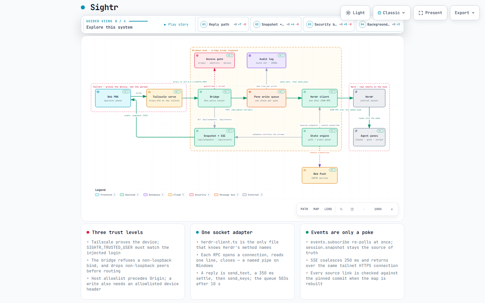

# Sightr

Sightr is a phone web UI for your [Herdr](https://herdr.dev) agent herd. A small Bun bridge runs on
the Windows host next to Herdr, and your phone opens it over Tailscale. You see which agent needs
you, read its chat, and answer with buttons or an ordinary text box, so phone dictation works.

- **One operator, one tailnet.** Sightr is not a multi-tenant service.
- **Harnesses:** Claude Code, pi, Grok Build, Antigravity CLI, Cursor CLI. The bridge reads each
  harness's own session log for chat history, and lifts detected prompts, permission cards and
  ask-cards into phone buttons.
- **Windows only.** The supervisor is Task Scheduler, the launcher is PowerShell, and Herdr's control
  socket is a named pipe.

## What you get

- **Needs you.** Blocked agents sit in an inbox above the space / tab / pane tree, most recently
  active first. A pane Herdr has named shows that name on the row, the header and a push.
- **Chat from the agent's own log.** Your messages are bubbles; tool-call runs fold to one line;
  thinking collapses to "Thought for 12s". The live terminal stays hidden until the agent is blocked
  or you ask for it.
- **Tap to answer.** Detected prompts, permission cards and ask-cards become buttons. A blocked
  agent with no buttons still gets Yes and No. The reply box is an ordinary text field, so phone
  dictation works.
- **Desktop mode.** Settings → Desktop: System, On or Off, stored per browser. Resizable sidebar,
  Composer or Direct typing, `Ctrl+backtick` arms typing, `Ctrl+F` finds, `Ctrl+Alt+Up`/`Down`
  change panes.
- **Push.** Opt in per device. The phone can notify when an agent needs input.
- **Reconnect lock.** Windows Hello or Face ID on the HTTPS tailnet URL, so an unlocked phone is
  not an open shell by itself.
- **Files.** Point `SIGHTR_WORK_ROOT` at a narrow folder and browse, preview, edit, or attach a
  file to a reply (images and text, 10 MB). Unset hides the tab.
- **Keys and commands.** Esc, Ctrl+C, arrows, a gesture wheel, and the harness's slash commands
  plus your `commands.toml`.

Sightr started as a fork of [AltanS/collie](https://github.com/AltanS/collie) and has been a separate
product since. It does not track collie.

**[Open the interactive system map ↗](https://bartholomewtj.github.io/sightr/archify/sightr-runtime.architecture.html)**
· [one phone reply, as a sequence ↗](https://bartholomewtj.github.io/sightr/archify/sightr-reply.sequence.html)
· generated with [Archify](https://github.com/tt-a1i/archify), see [Architecture](#architecture)

## Security, read this first

- Sightr is remote shell access to your Windows machine by design. Anyone who can reach the URL
  can act as you.
- Tailscale proves the device, not the person. Treat an unlocked phone as an open shell. The
  WebAuthn reconnect lock adds a device-level gate for returning to the app.
- The bridge refuses to start unless it binds a loopback address, and cross-checks the TCP peer
  address on every request. Publish it with `tailscale serve` (the default) or your own reverse
  proxy. Never use `tailscale funnel`.
- The `Host` header must match a loopback name, a discovered Tailscale name, or
  `SIGHTR_PUBLIC_HOSTS`. This is checked before anything else to defeat DNS rebinding.
- Set `SIGHTR_TRUSTED_USER` to your Tailscale login. With it set, every request must carry a
  matching `Tailscale-User-Login` header, which `tailscale serve` injects. The bridge warns at
  startup while it is unset.
- Every write to a pane, tab, space, file or setting is appended to `<state-dir>/audit.log` as one
  JSON line. The default keeps a 120-character preview of what you sent. Set
  `SIGHTR_AUDIT_CONTENT=none` to keep only who did what and when, or `SIGHTR_AUDIT=0` to record
  nothing. The file is owner-only, capped at 5 MB with one rotated copy, and nothing in Sightr reads
  it back.
- Uploads are accepted by byte signature, never by declared content type. SVG is refused.
- `SIGHTR_WORK_ROOT` is the whole of what the Files tab can read, edit and delete, from every
  device that can reach the bridge. Point it at the narrowest folder you need, never at a home
  directory, and leave it unset to hide the tab.

## Requirements

| Need | Why |
|---|---|
| Windows 10 or 11 | Task Scheduler supervisor, PowerShell launcher, `icacls` hardening, named-pipe socket |
| [Bun](https://bun.sh) | The only runtime. Bridge, control script and web build all run on it |
| [Herdr](https://herdr.dev) 0.7.0 or newer | Provides the agent control socket. 0.7.2 or newer enables session snapshots |
| Git | Only for a local checkout install and for `update` |
| [Tailscale](https://tailscale.com) | Recommended. Gives the private HTTPS URL and the identity header. Optional with `SIGHTR_SKIP_SERVE=1` and your own proxy |

## Install and run

Install the published plugin from PowerShell. Herdr runs the web build once at install time.

```powershell
herdr plugin install bartholomewtj/sightr
herdr plugin action invoke start --plugin herdr.sightr
```

Or link a local checkout. A linked checkout builds the web app and the Herdr action launcher on
its first `start` instead.

```powershell
git clone https://github.com/bartholomewtj/sightr.git
Set-Location sightr
herdr plugin link "$(Get-Location)"
herdr plugin action invoke start --plugin herdr.sightr
```

`start` builds the web app if `web/dist` is missing, registers and enables the `herdr.sightr` Task
Scheduler job, publishes the loopback port with `tailscale serve`, and prints status. If publishing
fails, the bridge is still reachable on `127.0.0.1:8787`.

If `start` prints `could not register the scheduled task ... Access is denied`, your account cannot
create scheduled tasks from a normal shell. Run that one `start` from a PowerShell window opened as
Administrator. The task itself still runs as your user at limited privilege. Later `stop`, `restart`
and `update` calls work from any shell: when re-registration is denied but the task already exists,
`start` warns, keeps the existing registration and starts it.

Then configure it. The bridge reads `.env` from the plugin config directory once, at startup.

```powershell
Copy-Item .env.example "$(herdr plugin config-dir herdr.sightr)\.env"
# edit .env: set SIGHTR_TRUSTED_USER and SIGHTR_PUBLIC_HOSTS at least
herdr plugin action invoke restart --plugin herdr.sightr
herdr plugin action invoke url --plugin herdr.sightr
```

On the phone: install Tailscale, join the same tailnet, open the URL, and add Sightr to the Home
Screen from Safari's share sheet or Chrome's menu. That installs the PWA. Home Screen install and
Web Push both need the HTTPS origin that the default serve mode provides.

The control script is the same thing without Herdr's JSON envelope:

```powershell
powershell.exe -NoProfile -ExecutionPolicy Bypass -File contrib\windows\sightr-ctl.ps1 <verb>
```

| What it does | Script verb | Herdr action |
|---|---|---|
| Start, stop, restart | `start`, `stop`, `restart` | `start`, `stop`, `restart` |
| Status, version, config check | `status`, `version`, `env-check` | `status`, `version`, `env-check` |
| Print the URL or a QR code | `url`, `qr` | `url`, script only |
| Update within, or across, a major version | `update`, `update --major` | `update`, `update-major` |
| Remove the scheduled task and serve mapping | `uninstall` | `uninstall` |
| Tail the bridge logs | `logs [N]` | script only |
| Claude beacon hooks | `hooks install claude`, `hooks uninstall claude`, `hooks status` | script only |
| Web Push keys and a test push | `push-keys`, `push-test` | `push-keys`, `push-test` |
| Build, publish or unpublish by hand | `build`, `serve`, `unserve` | script only |

`uninstall` keeps `.env` and the checkout. Read a Herdr action's captured output with
`herdr plugin log list --plugin herdr.sightr`.

## Configuration

Everything lives in the plugin config directory printed by `herdr plugin config-dir herdr.sightr`.
The directory falls back to `~/.config/sightr` when Herdr did not inject one.

| File | Purpose |
|---|---|
| `.env` | Bridge settings. Start from [`.env.example`](.env.example), which documents every key |
| `commands.toml` | Your slash commands for the Agent commands menu. Start from [`commands.toml.example`](commands.toml.example) |
| `keys.toml` | Keys-pad presets and gesture-wheel slices. Start from [`keys.toml.example`](keys.toml.example) |
| `sightr.log`, `sightr-error.log` | Bridge output. A crash keeps one `*-previous.log` pair |

`commands.toml` and `keys.toml` are re-read on change; reload the page. `.env` needs a `restart`.
A `commands.toml` row with a `scope` replaces the shipped catalog for that harness; other harnesses
keep theirs.

### Bridge settings

| Variable | Default | Effect |
|---|---|---|
| `SIGHTR_PORT` | `8787` | Loopback port |
| `SIGHTR_HOST` | `127.0.0.1` | Bind address. Must be loopback unless `SIGHTR_ALLOW_NON_LOOPBACK_BIND=1` |
| `SIGHTR_TRUSTED_USER` | unset | Required Tailscale login. Set it |
| `SIGHTR_TRUSTED_USER_OPTIONAL` | off | Tolerate a missing identity header. Host-local development only |
| `SIGHTR_PUBLIC_HOSTS` | unset | Extra allowed `Host` values, comma separated |
| `SIGHTR_ALLOWED_ORIGINS` | unset | Extra allowed `Origin` values |
| `SIGHTR_ALLOW_ANY_HOST` | off | Disable the Host allowlist. Warned at startup |
| `SIGHTR_DEVICE_HEADER`, `SIGHTR_DEVICE_ALLOWLIST` | unset | Optional per-device write authorisation. Unknown devices become read-only |
| `SIGHTR_AUDIT`, `SIGHTR_AUDIT_CONTENT` | `1`, `preview` | Audit trail on/off and `preview` or `none` |
| `SIGHTR_POLL_MS`, `SIGHTR_POLL_IDLE_MS` | `1500`, `12000` | Poll cadence, and the relaxed cadence while the Herdr event stream is healthy |
| `SIGHTR_NOTIFY_DELAY_MS` | `30000` | Wait before a blocked or finished agent pushes a notification |
| `SIGHTR_READ_LINES` | `200` | Terminal lines pulled on open |
| `SIGHTR_SUBMIT_KEYS` | `Enter` | Key sequence that submits a reply |
| `SIGHTR_TRANSCRIPT` | on | Read chat history from the harness's own session log |
| `SIGHTR_CLAUDE_ROOT`, `SIGHTR_PI_ROOT`, `SIGHTR_GROK_ROOT`, `SIGHTR_CURSOR_ROOT` | harness default | Where each harness keeps session logs, comma separated, searched in order |
| `SIGHTR_BEACONS` | on | Read the identity files Claude's hooks write |
| `SIGHTR_WORK_ROOT` | unset | Root of the Files tab, readable and writable from every device. Keep it narrow. Unset hides the tab and its routes |
| `SIGHTR_VAPID_PUBLIC`, `SIGHTR_VAPID_PRIVATE`, `SIGHTR_VAPID_SUBJECT` | unset | Web Push keys. `push-keys` writes them |
| `SIGHTR_PUSH_ALLOWED_HOSTS` | unset | Extra push-service hosts |
| `SIGHTR_STATE_DIR` | `~/.local/state/sightr` | Runtime state, when Herdr did not inject `HERDR_PLUGIN_STATE_DIR` |
| `HERDR_SOCKET_PATH` | `%APPDATA%\herdr\herdr.sock` | Herdr's control socket |

### Control-script settings

These are read by `sightr-ctl.ps1` and `scripts/ctl`, not by the bridge.

| Variable | Default | Effect |
|---|---|---|
| `SIGHTR_SKIP_SERVE` | off | Do not touch `tailscale serve`; you run the proxy |
| `SIGHTR_SERVE_MODE` | `https` | `http` or `https` for `tailscale serve` |
| `SIGHTR_PUBLIC_URL` | unset | URL to print and QR-encode under `SIGHTR_SKIP_SERVE` |
| `SIGHTR_TASK_NAME` | `herdr.sightr` | Task Scheduler job name |
| `SIGHTR_TASK_RUN_LEVEL` | `limited` | `highest` needs an Administrator shell. Only do this deliberately |
| `SIGHTR_UPDATE_REF` | unset | Tag or ref for `update` on a Herdr-managed checkout |
| `SKIP_VERSION_CHECK`, `SKIP_TYPECHECK` | off | Skip the `build` gates |

### State directory

Resolved as `HERDR_PLUGIN_STATE_DIR`, then `SIGHTR_STATE_DIR`, then `~/.local/state/sightr`.
Created owner-only at startup. It holds `audit.log`, `lock.json` (WebAuthn credentials),
`settings.json`, `notify-prefs.json`, `push-subscriptions.json`, `activity.json`,
`pane-claims.json`, `beacons/`, and `uploads/` (10 MB per file, 200 MB total, swept after 48 hours).

## On the phone

**Spaces tree.** A **Needs you** inbox sits above the space, tab, pane tree. Blocked agents sort
most-recently-active first. Git worktrees group under their primary checkout, as in Herdr. A pane
Herdr has named shows that name on the row, the header and the push. The `⋯` menu (or right-click)
renames or closes a row, opens a closed worktree, or removes a linked worktree without deleting its
branch.

**Pane view.** The pane reads like a chat, taken from the harness's own session log. Your messages
are blue bubbles; the agent's replies are plain text. Runs of tool calls fold into one line, thinking
collapses to "Thought for 12s". The live terminal hides while the agent is idle and returns when it
is blocked, a prompt is on screen, Type is armed, Find is open, or there is no session log. Tap the
title for the working directory, statusline, context fill, sibling panes, Find and Switch
pane. Detected prompts become buttons. A blocked agent with no detected buttons gets **Yes** and
**No** above the reply box.

**Replies.** Type and Send. The `+` menu offers Attach file (images and text up to 10 MB, uploaded
to the host and referenced by path), Keys (`Esc`, `Ctrl+C`, arrows, modifiers), Agent commands (the
harness's slash commands plus your `commands.toml`), Type into terminal, Terminal and Display. Tap
the circle on the reply box for Keys; hold it for the gesture wheel. Settings picks the wheel's
slices, up to six.

**Beacons.** Sightr normally works out who is in a pane by reading its screen. Claude's hooks can
instead write a small read-only file naming the pane, session and activity. `hooks install claude`
adds those hooks to your user-level `~/.claude/settings.json` (never a project's), leaves your own
hooks alone, and `hooks uninstall claude` removes only what Sightr wrote. A beacon can never send
input. It goes stale after 12 hours. Other harnesses still use the screen.

**Files.** With `SIGHTR_WORK_ROOT` set, browse, search, preview, copy a path, download, edit and save
text, or delete after a confirm. The Git panel shows read-only `git status` and `git diff`. Open in
browser renders HTML in a unique origin, not as Sightr, without CSS. A read-only device keeps copy
and download only.

**Desktop mode.** Settings offers System, On, Off, stored per browser. Resizable sidebar, Composer
or Direct typing, `Ctrl+backtick` arms direct typing, `Ctrl+F` finds, `Ctrl+Alt+Up`/`Down` change
panes. Multiline or destructive pasted text waits for confirmation.

**Push.** Opt-in per device under Settings → Push notifications. Settings → Notify when is
bridge-wide (Needs input on, Finished off by default). There is no quiet-hours mode. Generate keys,
restart, then send a test:

```powershell
powershell.exe -NoProfile -ExecutionPolicy Bypass -File contrib\windows\sightr-ctl.ps1 push-keys
powershell.exe -NoProfile -ExecutionPolicy Bypass -File contrib\windows\sightr-ctl.ps1 restart
powershell.exe -NoProfile -ExecutionPolicy Bypass -File contrib\windows\sightr-ctl.ps1 push-test
```

**Reconnect lock.** Enable it under Settings → Reconnect lock and register with Windows Hello or
Face ID. It needs the HTTPS tailnet URL; `http://127.0.0.1:8787` cannot register. Each browser has
its own credential, an unlock lasts 12 hours from last use, and a bridge restart asks again. Delete
`<state-dir>/lock.json` to reset every credential.

**Runtime settings.** Settings → Bridge changes the device allowlist, notify delay, submit keys and
read lines live, for every device, with no restart. Theme, display and wheel picks are per device.

## Windows service details

Herdr exposes its control socket as a named pipe and the bridge dials it through `node:net`.
`start` registers the `herdr.sightr` Task Scheduler job, which runs at logon, launches through
`wscript.exe` so no console window shows, and restarts after failures. The job wraps a watchdog: after
a 60-second grace period it probes `/api/snapshot` every 15 seconds and, after four consecutive
failures, kills the bridge, restarts it, and writes a `[supervisor]` line to `sightr-error.log`.

`stop` stops every bridge from this checkout and waits for the port to clear. `start` refuses to
stack a second listener on a busy port. Herdr actions run through `build\sightr-action-v1.exe`, a
tiny launcher that `build` compiles from `contrib/windows/sightr-action.cs`, because a Herdr action
needs a native executable rather than a script.

## Architecture

A Bun process sits between the phone and Herdr. The browser never touches the socket.

[](https://bartholomewtj.github.io/sightr/archify/sightr-runtime.architecture.html)

The maps under [`docs/archify/`](docs/archify/) are [Archify](https://github.com/tt-a1i/archify)
artifacts: typed JSON compiled into self-contained HTML. GitHub does not run them inside a README,
so open the hosted copies to pan, search nodes, trace reach and play the named views:

- [Runtime architecture ↗](https://bartholomewtj.github.io/sightr/archify/sightr-runtime.architecture.html)
  · [JSON source](docs/archify/sightr-runtime.architecture.json)
- [One phone reply, as a sequence ↗](https://bartholomewtj.github.io/sightr/archify/sightr-reply.sequence.html)
  · [JSON source](docs/archify/sightr-reply.sequence.json)

To regenerate after a change, see [`docs/archify/README.md`](docs/archify/README.md); the validator
checks every source reference in the map against the current commit.

**How a request travels.** The phone loads the PWA from `web/dist`, served by the bridge. The app
polls `GET /api/snapshot` and listens on `GET /api/events` (server-sent events). The bridge keeps its
own `events.subscribe` stream open to Herdr and pokes the SSE clients when Herdr reports a change,
but the snapshot poll stays the source of truth, so a missed poke costs one poll interval. A reply is
`POST /api/pane/...`: the access layer checks peer address, Host, Origin, the Tailscale identity
header and the device allowlist, the write is queued per pane, sent over the Herdr socket as
`pane.send_text` plus the submit keys, and appended to the audit log.

**Where things live.**

| Path | What |
|---|---|
| `bridge/index.ts`, `bridge/server.ts` | Process start, route table, static serving |
| `bridge/config.ts` | Every environment variable, loopback enforcement |
| `bridge/access.ts` | Host, Origin, identity and device checks, startup warnings |
| `bridge/herdr-client.ts` | The only file that knows Herdr's JSON-RPC method names |
| `bridge/state-engine.ts`, `bridge/event-poker.ts` | Snapshot polling and the Herdr event stream |
| `bridge/journal/` | One session-log reader per harness (`claude`, `pi`, `grok`, `cursor`) |
| `bridge/beacon/`, `bridge/beacon-io.ts` | Claude hook identity files |
| `bridge/webauthn.ts`, `bridge/lock.ts` | Reconnect lock, WebAuthn verification from scratch |
| `bridge/audit.ts`, `bridge/uploads.ts`, `bridge/push.ts` | Audit trail, attachments, Web Push |
| `bridge/state-migrate.ts` | One-time copy of a sibling state directory if this one is empty |
| `shared/agents.ts` | The harness descriptor table: brand, slash commands, journal roots |
| `shared/wire.ts`, `shared/limits.ts` | Types and limits both sides agree on |
| `web/src/routes/` | Spaces tree, pane view, files, settings |
| `web/src/lib/harness/` | Screen parsers per harness: prompts, ask-cards, permission cards |
| `web/src/lib/`, `web/src/hooks/`, `web/src/components/` | API client, ANSI parsing, transcript folding, UI |
| `web/src/fixtures/panes/` | Captured terminal screens the harness parsers are tested against |
| `scripts/ctl.ts`, `scripts/ctl/` | Every control verb, supervisor, `tailscale serve`, update |
| `scripts/bump.ts`, `scripts/check-version.ts` | Version bump and the version consistency gate |
| `contrib/windows/` | PowerShell entry point, action launcher source, their tests |
| `docs/archify/` | System maps, served by GitHub Pages |
| `docs/adr/` | Architecture decision records. Code comments cite them by number (`ADR 0009`) |
| `docs/HERDR_API.md` | The Herdr socket protocol facts the bridge relies on |

## Development

Bun runs everything. There is no Node toolchain to install.

```powershell
bun install                    # root: bridge, scripts, shared
cd web; bun install; cd ..     # web app
bun run dev                    # bridge with --watch on 127.0.0.1:8787
bun run web:dev                # Vite dev server proxying /api to the bridge
bun run test                   # typecheck + bridge and ctl tests (bun test)
cd web; bun run test           # typecheck + Vitest with Testing Library and MSW
bun run build                  # typecheck both, build web/dist
```

- **Tests sit beside their source** as `*.test.ts` / `*.test.tsx`. `bridge/test/fake-herdr.ts` is a
  fake Herdr socket for integration-style tests. Control-script tests inject a fake `Run`, so they
  never shell out and do not need Windows.
- **Adding a harness.** Add a descriptor to `shared/agents.ts`, a session-log reader under
  `bridge/journal/` if the harness keeps one, and a screen parser under `web/src/lib/harness/`.
  Capture real screens into `web/src/fixtures/panes/<agent>--<state>.txt` and test against them.
  Keep Herdr method names inside `bridge/herdr-client.ts`.
- **Versions.** `herdr-plugin.toml` is canonical. `bun scripts/bump.ts patch|minor|major --note "..."`
  mirrors it into both `package.json` files and adds a `CHANGELOG.md` entry. `bun scripts/check-version.ts`
  fails when they disagree, and runs in CI and in `build`.
- **CI** (`.github/workflows/ci.yml`) runs on push to `main` and on pull requests: frozen installs,
  the version gate, typecheck and tests for root and web, then the web build. It only reads the repo.
- **Vite dev from another device.** `SIGHTR_DEV_TARGET` points the proxy at a bridge;
  `SIGHTR_DEV_HOSTS` adds Host names the dev server accepts.

## Troubleshooting

- **403 "host not allowed"** from the phone: the request's `Host` is not in the allowlist. Add the
  MagicDNS name to `SIGHTR_PUBLIC_HOSTS`, or run `status`, which also reports whether the tailnet
  packet filter blocks inbound traffic.
- **401 with `SIGHTR_TRUSTED_USER` set**: the request had no matching identity header. Tagged nodes
  get none from `tailscale serve`; a reverse proxy of your own must inject it, or run with
  `SIGHTR_SKIP_SERVE=1` and your own authentication.
- **`status` says listening but not answering**: the bridge is wedged. The watchdog restarts it within
  about a minute; `restart` does it now.
- **Stale UI after an update**: the bridge sends the build in an `X-Sightr-Build` header and the app
  compares it with its own; hard-refresh once if the PWA still shows the old version.
- **Logs**: `logs 200` tails the config-directory logs. Bridge startup prints every security warning
  it has, so read the first lines first.

## License

MIT. See [LICENSE](LICENSE). Sightr is a fork of collie by Altan Sarisin; both copyright notices are
kept.
